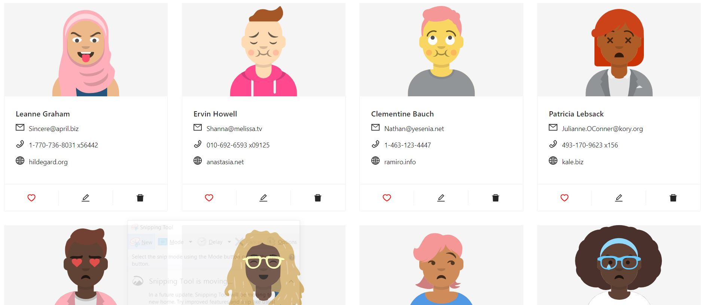
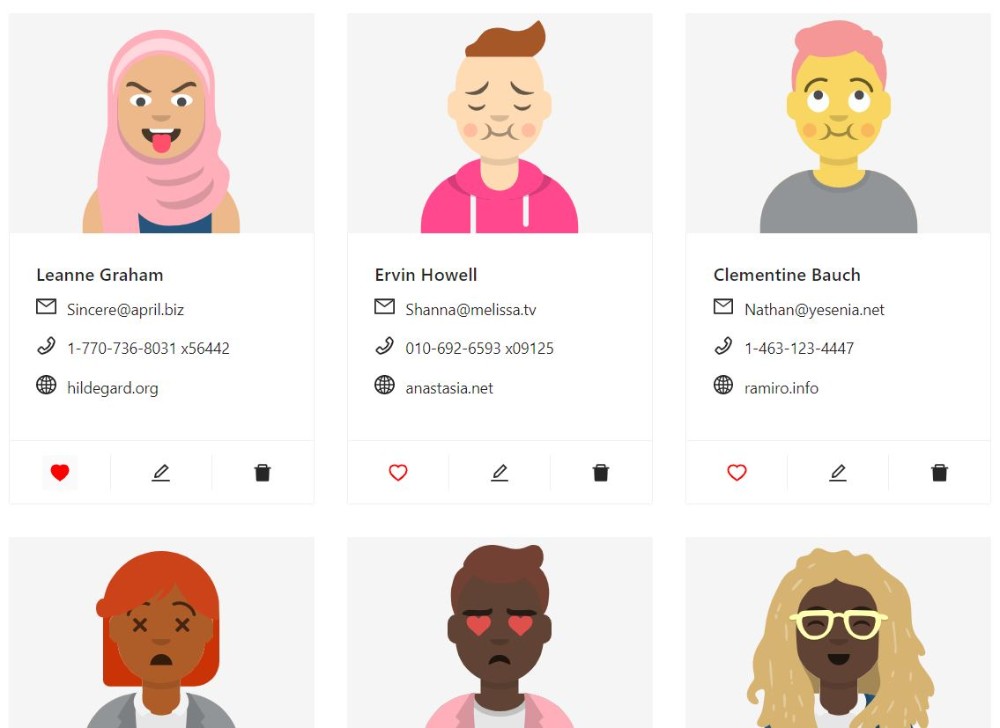
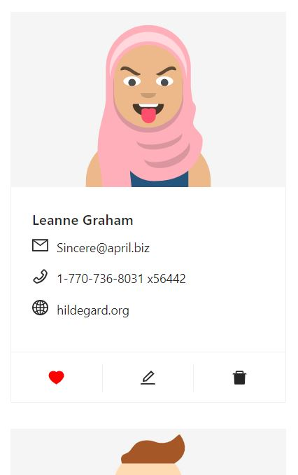
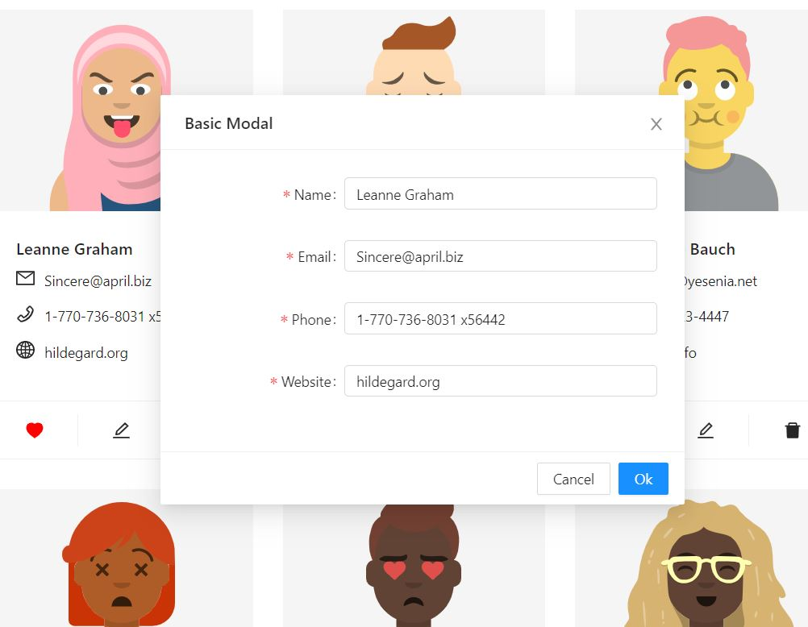

## Responsive UI Design using Ant Design Library

## Technologies used
* HTML
* CSS
* JS
* React Js

### Features
*  Users Details List
*  Wishlist User
*  Edit User Details
*  Delete User
*  Responsive

#### Demo

  
  
  

   
  
  
   
  
  
   
  
  
   
 

